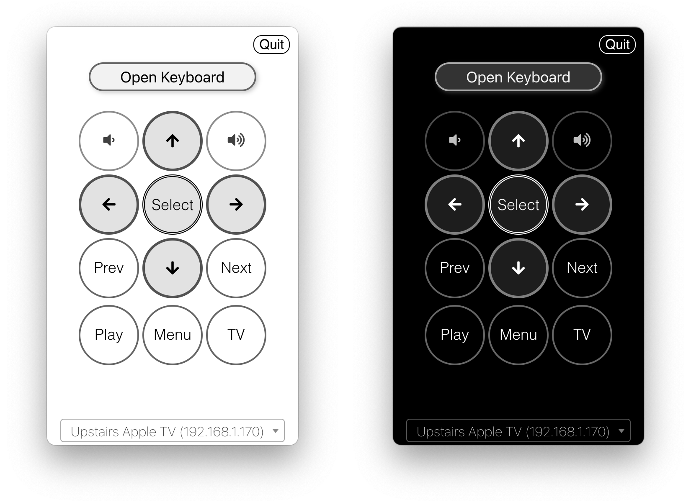
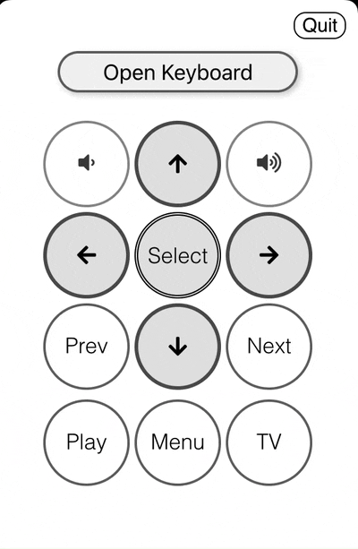

# ATV Desktop Remote
A simple menubar app that allows you to control an Apple TV from your desktop

 

## New in v1.5.0
- **Power Button**: Press 'Z' to put your Apple TV to sleep
- **Siri Button**: Press 'S' to activate Siri voice control  
- **Improved Play/Pause**: Enhanced functionality works seamlessly with any current app
- **Better UI**: Added tooltips and improved button layout

## Installation 

If you have homebrew installed `brew install atv-remote`

macOS and Windows versions can be downloaded from here: https://github.com/bsharper/atv-desktop-remote/releases

## Usage

 1. Keys are mapped to the keyboard when the application is open (pressing return or enter on the keyboard for select, delete for Menu, etc).
 2. Press `Option`, or `Alt` on Windows, to see what the characters are mapped to when the application is open.
 3. Long press buttons now works to simulate long presses on the remote
 4. **New**: Press 'Z' for Power/Sleep and 'S' for Siri functionality
 
 

  

 
 
 
 ## Running

 1. Run `npm install` (`yarn` and `pnpm` should also work)
 2. Run `npm start`
 3. The application runs in the menubar. Look for a tiny remote icon and click on it. Right-click for more options.
 4. The first time the app runs it will need to pair with an Apple TV. You can pair with more than one.
 5. Press `Cmd+Shift+R` to open the application from anywhere. On Windows its `Win+Shift+R`

## Building

1. `electron-builder` is used to create a standalone application.

## Notes

This is cobbled together from a few projects I've worked on. It works well enough for me for daily use, so I figured others might like it. 

This project is built using [pyatv.](https://pyatv.dev/)

